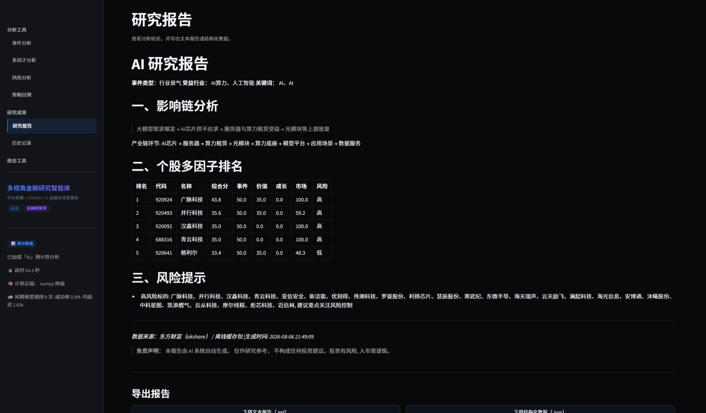
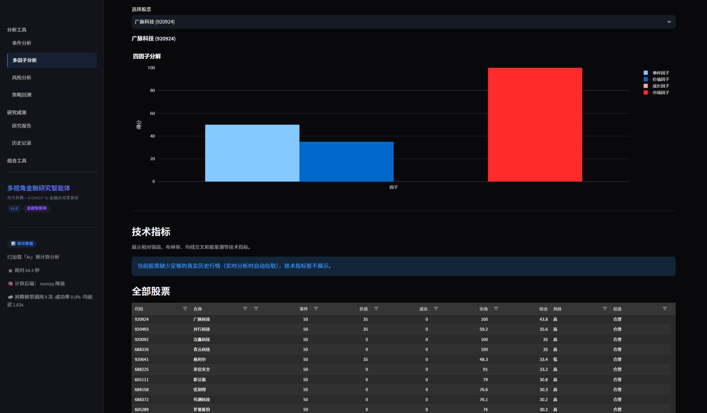
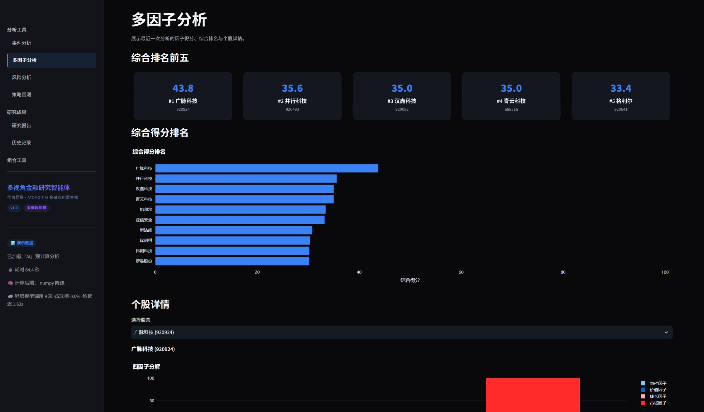
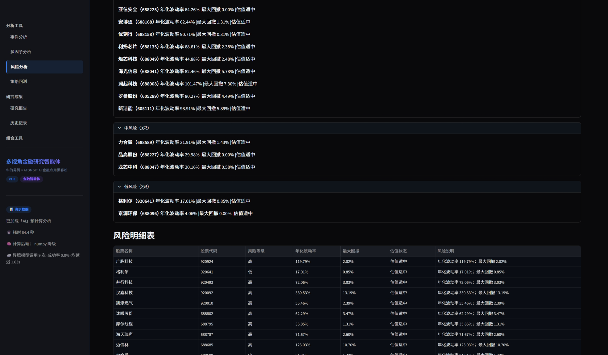
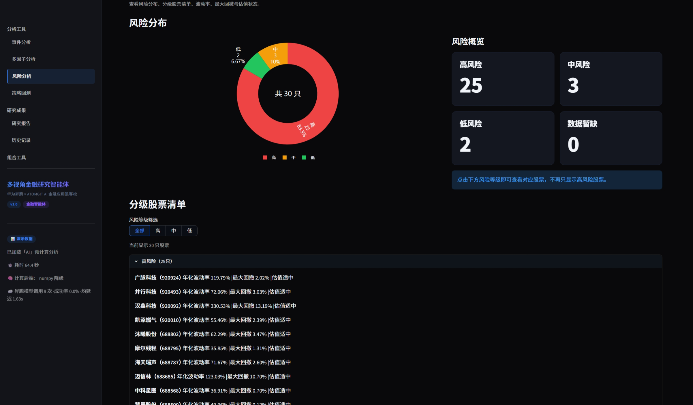
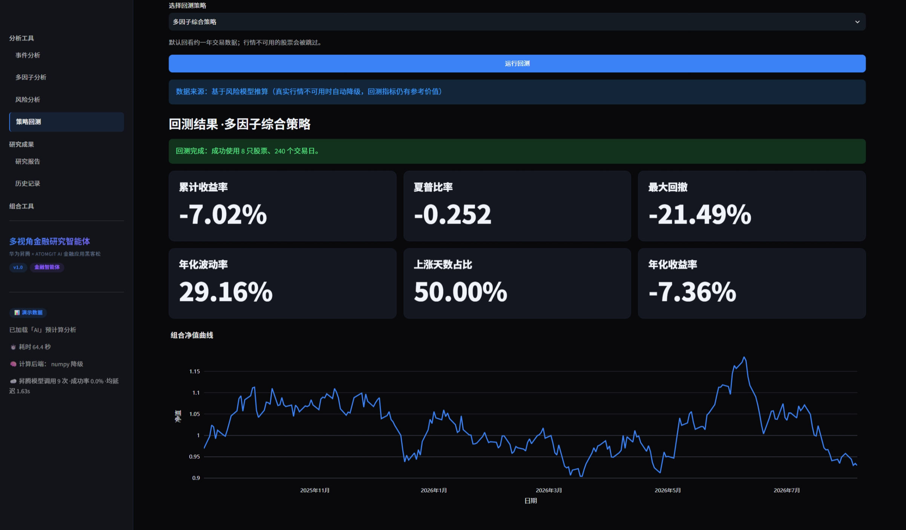
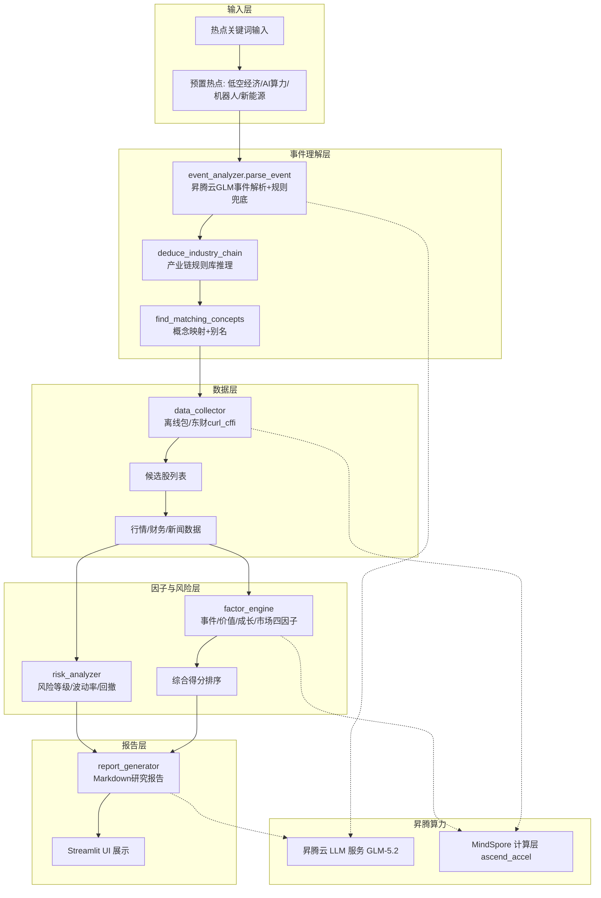

# 多视角金融研究 Agent

> **华为昇腾 × AtomGit AI 金融应用 Agent 黑客松项目**
> 昇腾 MindSpore 加速 · 昇腾云大模型 · ReAct 智能体 · 事件驱动四因子分析

输入一个金融热点关键词，智能体自动完成**事件理解 → 产业链推理 → 候选股筛选 → 四因子评分 → 风险分析 → 研究报告**的全链路研究；开启 **Agent 模式**后，大模型自主调用行情/财务/新闻/风险工具完成研究，过程全程可追溯。

**合规边界**：系统输出"研究参考"，不构成投资建议。

---

## ✨ 核心特性

- **ReAct 智能体（真 Agent）**：`src/orchestrator.py` 让 LLM 自主决策查什么、按什么顺序查；10 个金融工具（`src/agent_tools.py`）可被模型实时调用；失败自动降级，永不空手而归
- **昇腾原生算力**：`src/ascend_accel.py` 基于 **MindSpore（昇腾原生 AI 框架）** 实现协方差/归一化计算，昇腾环境自动启用 NPU 加速；昇腾云大模型负责事件解析与报告生成
- **事件驱动四因子**：事件 / 价值 / 成长 / 市场四维评分，叠加风险等级（波动率/回撤/估值）与产业链传导逻辑
- **真实数据链路**：东财 curl_cffi 直连（绕 TLS 风控）+ 离线包兜底 + 联网新闻缓存，三级降级设计
- **可信回测**：买入持有 + 交易成本（佣金/印花税/滑点），基准收益按日期对齐，协方差按交易日对齐
- **122 个单元测试**：含 Agent 工具层/编排器/回测费用/协方差/昇腾模块的离线确定性测试

## 🖼️ 界面预览

| 事件研究报告 | 多因子分析 |
|---|---|
|  |  |

| 多因子排名 | 风险分析 |
|---|---|
|  |  |

| 风险分布 | 策略回测 |
|---|---|
|  |  |

> 📽️ 演示视频：[金融研究 Agent 演示录屏（2 分半）](https://github.com/zhic436-stack/agent_finance/releases/download/v1.0.0-demo/demo_video_2min30s.mp4)

## 🖥️ 快速开始

```bash
# 1. 克隆
git clone https://github.com/zhic436-stack/agent_finance.git
cd agent_finance

# 2. 安装依赖
pip install -r requirements.txt

# 3. 配置环境变量 (可选项, 不配置自动降级为规则兜底)
cp .env.example .env
# 编辑 .env 填入 ASCEND_API_KEY

# 4. 启动 (默认端口 8532)
python -m streamlit run ui/app.py --server.port 8532
```

浏览器访问 **http://localhost:8532**

> **Windows 用户**：直接双击 `启动网站.cmd`（自动检查依赖、生成 .env、启动服务；关闭窗口即停止，另附 `停止网站.cmd`）

## 🧠 Agent 模式（模型自主研究）

事件分析页勾选 **"Agent 模式"**，LLM 不再走固定流程，而是自主调用金融工具（OpenAI function-calling）完成研究：

```
parse_event → deduce_industry_chain → find_matching_concepts
  → get_concept_stocks → 对重点股票逐一 get_stock_risk / get_stock_market_data
  → 输出研究结论 + Markdown 报告
```

- **工具层**（`src/agent_tools.py`，10 个）：事件解析 / 产业链 / 概念成分股 / 行情 / 财务 / 新闻 / 风险 / 主题新闻(联网缓存) / 离线主题
- **编排器**（`src/orchestrator.py`）：ReAct 循环，工具结果回填再决策；最后一轮强制总结；失败自动降级报告模式
- **过程可观测**：事件分析页底部"执行轨迹"展示每一步工具调用
- 提示：Agent 模式较慢（每轮 LLM 响应数秒~数十秒）；预置主题默认走演示缓存，秒开

## 🔧 昇腾技术栈

- **昇腾云 LLM 推理**：事件解析 / Agent 决策 / 报告生成调用昇腾云大模型 API（`ASCEND_API_BASE`，GLM-5.2 on Ascend）
- **MindSpore 计算层**：`src/ascend_accel.py` 用昇腾原生框架 MindSpore 实现协方差/归一化，昇腾环境自动启用 NPU（本机 numpy 降级，结果一致）
- **证据可视化**：UI 侧边栏展示「计算后端」与「昇腾模型调用」统计
- 详见 [`docs/昇腾技术栈说明.md`](docs/昇腾技术栈说明.md)（架构图、合规对照表、昇腾环境部署步骤）

## 🏗️ 架构图



## 📂 目录结构

```
agent_finance/
├── ui/
│   ├── app.py              # Streamlit 主入口 (端口 8532)
│   ├── pages/              # 7 个功能页 (事件/多因子/风险/报告/历史/回测/组合)
│   └── components/         # 复用组件 (卡片/图表/轨迹/页脚)
├── src/
│   ├── data_collector.py   # 数据采集 (curl_cffi + 离线包)
│   ├── event_analyzer.py   # 事件解析 + 产业链推理
│   ├── factor_engine.py    # 四因子引擎
│   ├── risk_analyzer.py    # 风险分析 (波动率/回撤/估值)
│   ├── report_generator.py # 报告生成
│   ├── pipeline.py         # 全链路编排 (use_agent 走 Agent 路径)
│   ├── cache_manager.py    # 三级缓存
│   ├── agent_tools.py      # Agent 工具层 (10 个 LLM 可调用金融工具)
│   ├── orchestrator.py     # ReAct 编排器 (LLM 自主研究循环)
│   ├── ascend_accel.py     # 昇腾 MindSpore 加速模块 (NPU 自动启用)
│   ├── backtest_engine.py  # 回测 (买入持有 + 交易成本)
│   └── real_covariance.py  # 真实协方差 (按日期对齐)
├── data/
│   ├── industry_chains.json    # 产业链规则库
│   ├── news_cache.json         # 联网搜索最新主题新闻
│   └── offline/                # 离线缓存包
├── scripts/                 # 演示准备/数据抓取脚本
├── docs/                    # 交付文档 + 昇腾技术栈说明
├── tests/                   # 122 个单元测试
├── config.py                # 全局配置
├── requirements.txt
└── README.md
```

## 🎬 演示流程（5 步走）

1. **启动**：`python -m streamlit run ui/app.py --server.port 8532` → 浏览器访问 http://localhost:8532
2. **事件分析页**：点击预置热点（低空经济 / AI算力 / 机器人 / 新能源），或输入自定义关键词
3. **多因子分析页**：查看四因子排名图 + 个股雷达图
4. **风险分析页**：风险等级分布 + 波动率/回撤
5. **研究报告页**：完整 Markdown 报告（含免责声明）+ 导出

> 现场演示建议：预置热点秒开（读 demo_state），再勾选 **Agent 模式**现场发起一次分析，展示模型自主调用工具的真实推理过程。

## ⚡ 性能数据

> 实测环境: Windows 11 · Python 3.13 · CPU 开发机 (昇腾 NPU 数据待赛事环境补充)

| 指标 | 实测值 | 说明 |
|------|--------|------|
| 预置主题加载 | **< 1 秒** | 演示缓存 (demo_state) 秒开 |
| 真实分析全链路 | 约 1~4 分钟 | 受昇腾云 LLM 响应影响 (每轮 1.7s~60s)，工具执行并行 |
| 昇腾云 LLM 单次调用 | 均延迟 ~1.7s | 侧边栏实时统计 (成功率/延迟可视化) |
| 单元测试 | **122 个 · 65s** | 全离线 mock，确定性验证 |
| 协方差矩阵 (3 股 × 40 日) | < 1s | numpy 降级; 昇腾环境由 MindSpore NPU 加速 |
| 回测 (8 股 × 241 交易日) | ~4s | 买入持有 + 交易成本 |
| 回测收益 (2025 低空股池, 含费) | 累计 +112.5% / 基准 +21.2% | 含佣金/印花税/滑点，Sharpe 1.40 |

> 昇腾 NPU 部署后 (scripts/deploy_ascend.sh)，协方差/归一化由 MindSpore 在 NPU 执行，性能数据见赛事环境实测日志。

## 💼 商业化说明

### 落地场景
1. **券商/基金投研**：输入热点自动生成"事件→产业链→候选股→风险"研报初稿，研究员聚焦复核与判断，人均产能提升 5~10 倍
2. **财经内容生产**：自媒体/投教机构批量生成主题研究报告与素材，降低内容生产成本
3. **个人投资者研究助理**：替代手工翻 20+ 数据页面，把"想清楚"的时间还给决策
4. **高校金融实验室**：事件驱动量化研究的教学与课题平台

### 目标客户
- **B 端**：券商研究所、基金公司投研部、财经媒体、财富管理机构（核心付费方）
- **C 端**：专业投资者、量化爱好者、财经内容创作者（订阅制）

### 商业模式
| 模式 | 说明 |
|------|------|
| **SaaS 订阅** | B 端席位制 (按研究席/月)，C 端个人版 (按主题/月) |
| **API 服务** | 事件解析 / 四因子计算 / 风险评分 / 报告生成开放 API，按调用量计费 |
| **私有化部署** | 券商/基金内网部署 + 昇腾一体机，数据不出域，满足合规 (金融数据保密) |
| **内容合作** | 与媒体/投教平台合作分发研究报告，按流量分成 |

**竞争壁垒**：事件驱动产业链推理的领域知识 + 昇腾端侧算力部署能力 + 可解释的因子/风险框架（区别于通用大模型问答）。

## 🛠️ 技术要点

- **数据采集**：东财对 python requests 有 TLS 指纹风控，统一用 curl_cffi（实测确认）
- **离线优先**：概念成分股固化在离线包，避免现场网络抖动
- **降级设计**：每一环失败都返回友好空态，页面永不崩溃（含 Agent 路径降级）
- **可复现**：离线模式下因子计算完全确定（集成测试验证）
- **回测可信**：买入持有 + BACKTEST_CONFIG 交易成本，基准收益按日期对齐
- **协方差真实**：收益向量按交易日对齐（修复停牌/上市错位），失败股填充平均方差
- **新闻时效**：data/news_cache.json 由联网搜索预生成，Agent 可读取最新政策/行业新闻
- **测试**：122 个单元测试（Agent 工具层/编排器/回测费用/协方差对齐/昇腾模块，全部离线 mock）

## 📝 测试

```bash
python -m pytest tests/ --ignore=tests/test_data_sources.py --ignore=tests/test_integration.py --ignore=tests/test_final.py
# 122 passed
```
