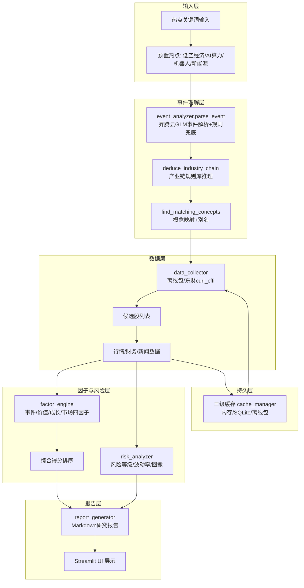

# 多视角金融研究 Agent

> 华为昇腾 × AtomGit AI 金融应用 Agent 黑客松项目

基于昇腾云大模型的事件驱动金融研究 Agent，通过多视角因子分析（事件/价值/成长/市场）和真实数据验证，生成可解释的研究参考报告。

**合规边界**: 系统输出"研究参考"，不构成投资建议。

---

## 架构图



## 目录结构

```
agent_finance/
├── app.py                  # Streamlit 主入口
├── config.py               # 所有配置参数
├── src/
│   ├── data_collector.py   # 数据采集 (curl_cffi + 离线包)
│   ├── event_analyzer.py   # 事件解析 + 产业链推理
│   ├── factor_engine.py    # 四因子引擎
│   ├── risk_analyzer.py    # 风险分析
│   ├── report_generator.py # 报告生成
│   ├── pipeline.py         # 全链路编排 (支持 use_agent 走 Agent 路径)
│   ├── cache_manager.py    # 三级缓存
│   ├── agent_tools.py      # Agent 工具层 (10 个 LLM 可调用金融工具)
│   ├── orchestrator.py     # ReAct 编排器 (LLM 自主研究循环)
│   └── backtest_engine.py  # 回测 (买入持有 + 交易成本)
├── ui/
│   ├── app.py              # 主入口
│   ├── pages/              # 4个功能页
│   └── components/         # 复用组件
├── data/
│   ├── industry_chains.json    # 产业链规则库
│   ├── news_cache.json         # 联网搜索的最新主题新闻 (供 get_topic_news)
│   └── offline/                # 离线缓存包
├── scripts/
│   └── demo_prep.py            # 演示准备
└── tests/                       # 单元+集成测试
```

## 快速启动

### 1. 安装依赖

```bash
pip install -r requirements.txt
```

### 2. 配置环境变量

```bash
cp .env.example .env
# 编辑 .env, 填入真实 API Key
```

```env
ASCEND_API_BASE=https://api-ai.gitcode.com/v1
ASCEND_API_KEY=你的API_KEY
ASCEND_MODEL=zai-org/GLM-5.2
```

> 未配置 API Key 时系统自动降级为规则兜底，功能可用但报告不走 LLM 润色。

### 3. 启动 UI

```bash
streamlit run ui/app.py
```

浏览器打开 http://localhost:8501

### 4. (可选) 预生成演示数据

```bash
python scripts/demo_prep.py          # 生成 demo_state.json (含实时行情, 慢)
python scripts/demo_prep.py --no-market  # 离线复现 (快, 市场因子为0)
```

## Agent 模式（模型自主研究）

事件分析页可勾选 **"Agent 模式"**：LLM 不再走固定流程，而是自主调用金融工具（OpenAI function-calling）完成研究：

```
parse_event → deduce_industry_chain → find_matching_concepts
  → get_concept_stocks → 对重点股票逐一 get_stock_risk / get_stock_market_data
  → 输出研究结论 + Markdown 报告
```

- **工具层** (`src/agent_tools.py`, 10 个工具): 事件解析 / 产业链 / 概念成分股 / 行情 / 财务 / 新闻 / 风险 / 主题新闻(联网缓存) / 离线主题
- **编排器** (`src/orchestrator.py`): ReAct 循环, 工具结果回填再决策; 最后一轮强制总结; 失败自动降级报告模式, 永不空手而归
- **降级保障**: Agent 失败或 LLM 不可用时, `run_analysis` 自动降级回固定流程, 页面照常出结果
- **观察 Agent 过程**: 事件分析页底部"执行轨迹"展示每一步工具调用
- 提示: Agent 模式较慢 (每轮 LLM 响应数秒~数十秒); 预置主题默认走演示缓存, 秒开

## 演示流程（5步走）

1. **启动**: `streamlit run ui/app.py`
2. **首页**: 点击预置热点（低空经济 / AI算力 / 机器人 / 新能源）
3. **事件分析页**: 查看事件类型 + 产业链推理 + Agent 执行轨迹
4. **多因子分析页**: 查看四因子排名图 + 单股雷达图
5. **研究报告页**: 展示完整 Markdown 报告（含免责声明）

> 现场演示建议：预置热点秒开（读 demo_state），再现场发起一次分析展示 Agent 轨迹。

## 技术要点

- **数据采集**: 东财对 python requests 有 TLS 指纹风控，统一用 curl_cffi（实测确认）
- **离线优先**: 概念成分股固化在离线包，避免现场网络抖动
- **降级设计**: 每一环失败都返回友好空态，页面永不崩溃（含 Agent 路径降级）
- **可复现**: 离线模式下因子计算完全确定（集成测试验证）
- **回测可信**: 买入持有 + BACKTEST_CONFIG 交易成本（佣金/印花税/滑点），基准收益按日期对齐，不再虚高
- **协方差真实**: 收益向量按交易日对齐（修复停牌/上市错位），失败股填充平均方差
- **新闻时效**: data/news_cache.json 由联网搜索预生成，Agent 可读取最新政策/行业新闻
- **测试**: 117 个单元测试（含 Agent 工具层/编排器/回测费用/协方差对齐的离线 mock 测试）
