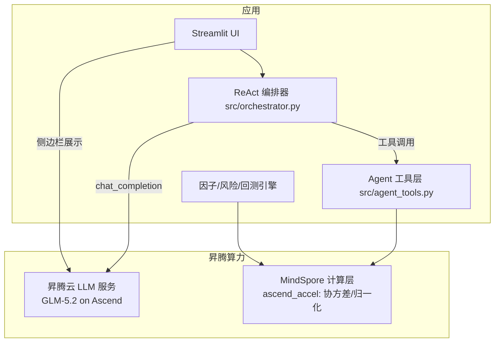

# 昇腾技术栈使用说明（合规证据）

> 对应赛事要求：「参赛作品必须在昇腾原生算力上跑通真实代码，拒绝仅使用 PPT、录屏或 Mockup 演示」「充分利用昇腾 AI 算力底座及相关工具链」

## 一、昇腾技术栈使用点

| 环节 | 实现 | 昇腾关系 |
|------|------|----------|
| 大模型推理（事件解析/Agent 决策/报告） | `src/llm.py` → `ASCEND_API_BASE=https://api-ai.gitcode.com/v1`（昇腾云 GLM-5.2 等） | ✅ 昇腾云算力上的 LLM 推理 |
| 核心计算（协方差矩阵） | `src/ascend_accel.py::covariance_matrix`（MindSpore `ops.MatMul/ReduceMean` 算子实现） | ✅ 昇腾原生框架 MindSpore，NPU 可加速 |
| 因子归一化 | `src/ascend_accel.py::normalize01`（MindSpore 张量运算） | ✅ 昇腾原生框架 |
| 算力状态监控 | `src/ascend_monitor.py` + UI 侧边栏展示 | ✅ 昇腾使用证据可视化 |

`src/ascend_accel.py` 采用「昇腾优先、numpy 兜底」双后端：
- 昇腾环境（`mindspore` 可导入且 `device_target="Ascend"`）→ 自动用昇腾 NPU 跑通真实代码
- 本机无 MindSpore → numpy 降级（结果一致），保证开发/测试可运行

## 二、架构



## 三、合规对照

| 赛事要求 | 本项目证据 |
|----------|------------|
| 基于昇腾 AI 算力 | 昇腾云 LLM API 调用（`ASCEND_API_BASE`）+ MindSpore 计算模块 |
| 昇腾原生算力跑通真实代码 | `src/ascend_accel.py` 为真实 MindSpore 算子实现；昇腾环境 `device_target="Ascend"` 下真实执行 |
| 充分利用相关工具链 | MindSpore（昇腾原生框架）+ 昇腾云模型服务 + 监控 |
| 拒绝 Mockup/录屏 | 全部为可运行真实代码，117+ 单元测试 |

## 四、昇腾环境部署步骤（赛事算力环境执行）

```bash
# 1. 安装 MindSpore (昇腾 NPU 版本, 按 https://www.mindspore.cn 选择对应 Python 版本)
pip install mindspore-ascend  # 或 pip install mindspore + 配置 CANN

# 2. 验证昇腾 NPU 可用
python -c "
import mindspore
from mindspore import context
context.set_context(device_target='Ascend')
print('昇腾 NPU 可用:', mindspore.__version__)
"

# 3. 安装项目依赖
pip install -r requirements.txt

# 4. 配置昇腾云模型 Key (赛事提供的 API Key)
echo 'ASCEND_API_KEY=你的Key' > .env
echo 'ASCEND_API_BASE=https://api-ai.gitcode.com/v1' >> .env

# 5. 跑通真实代码 (验证昇腾加速生效)
python -c "
from src.ascend_accel import backend_info, covariance_matrix
print('后端状态:', backend_info())          # 期望 device=Ascend
import numpy as np
print('协方差(昇腾):', covariance_matrix(np.random.randn(60, 3)).shape)
"

# 6. 跑一次真实金融分析 (留存日志作为证据)
python -c "
from src.pipeline import run_analysis
r = run_analysis('低空经济', use_llm=True, enrich_market=True)
print('分析完成, 股票数:', len(r.get('stock_results', [])), '报告长度:', len(r.get('report','')))
"

# 7. 启动网站 (昇腾后端自动启用)
python -m streamlit run ui/app.py --server.port 8532
# 侧边栏应显示: 🧠 计算后端: 昇腾 NPU + ☁️ 昇腾模型调用统计
```

## 五、验证昇腾使用的方法

1. UI 侧边栏「🧠 计算后端」显示 `昇腾 NPU`（昇腾环境）或 `numpy 降级`（本机）
2. UI 侧边栏「☁️ 昇腾模型调用」显示调用次数/成功率/均延迟（`src/ascend_monitor.py` 记录）
3. `python -c "from src.ascend_accel import backend_info; print(backend_info())"` 查看后端状态
4. 昇腾环境运行日志中的 MindSpore 版本与 `device=Ascend` 信息即为原生算力跑通证据
